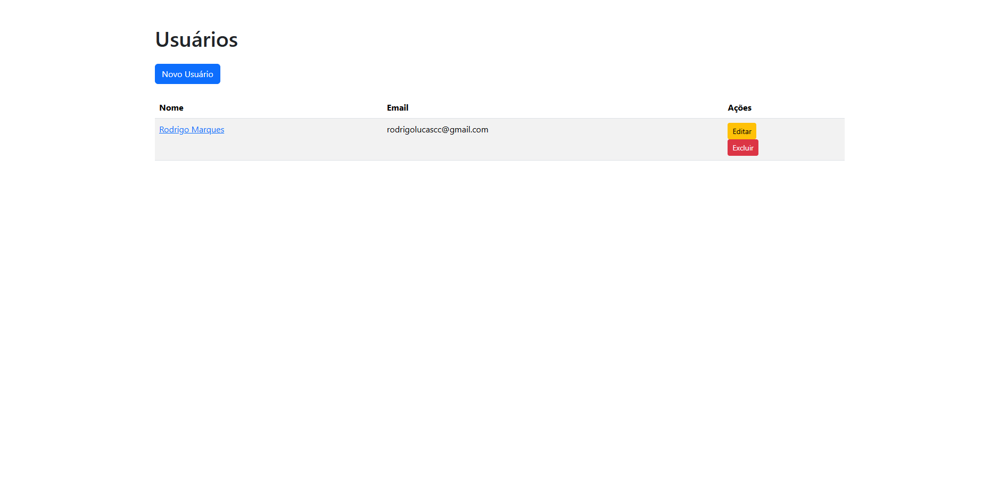
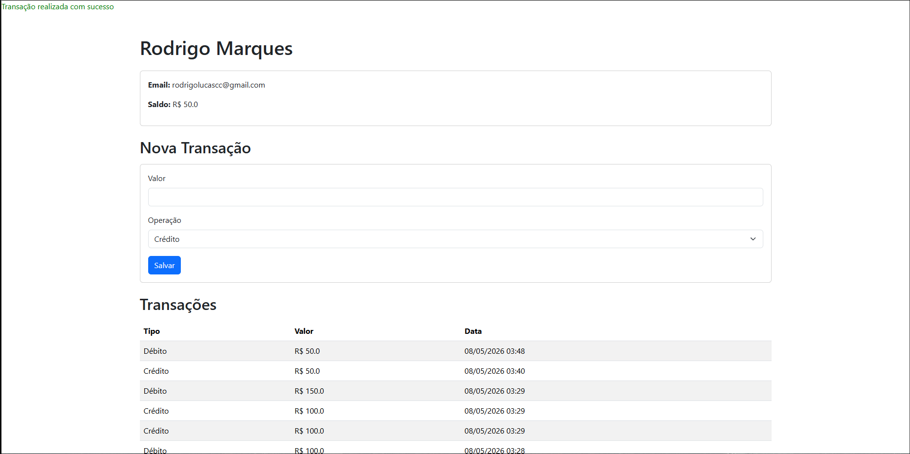
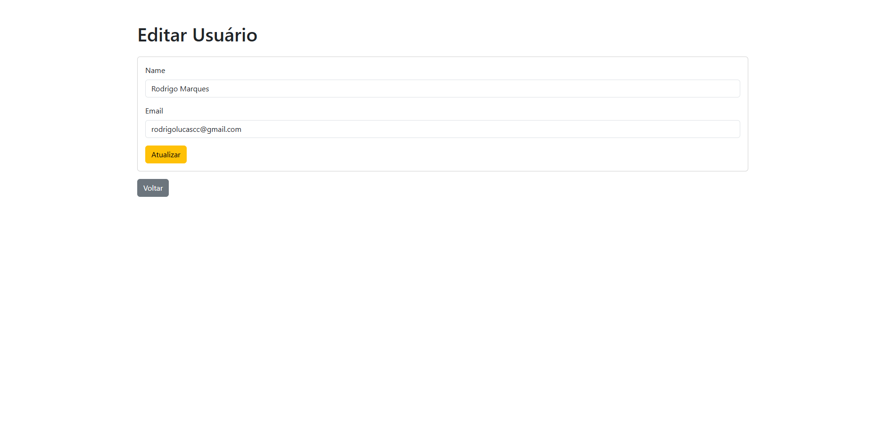
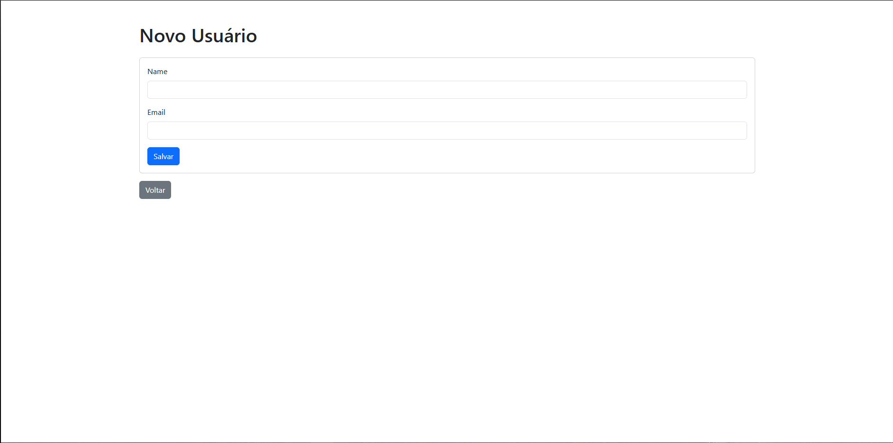
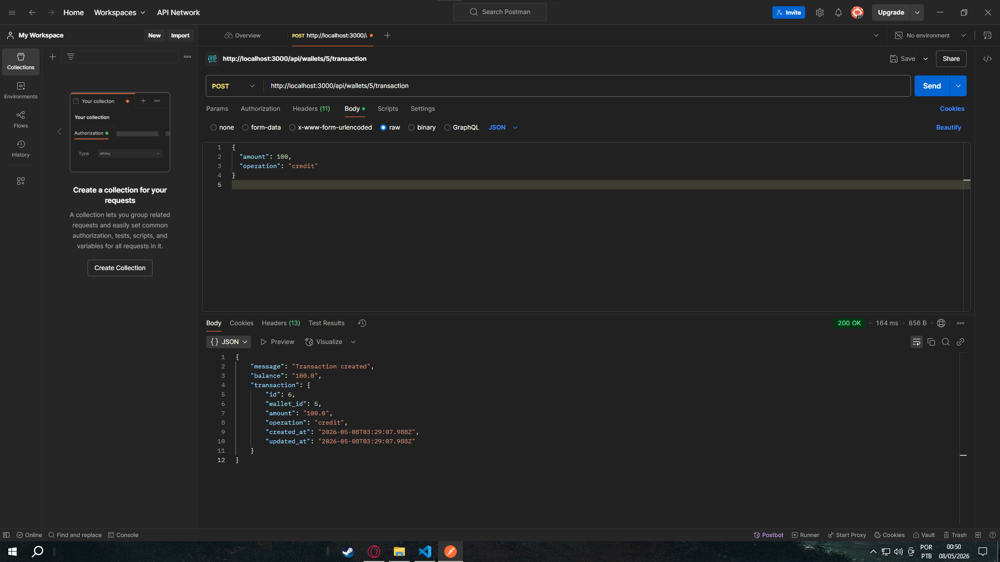

# Wallet App

Aplicação desenvolvida em Ruby on Rails para gerenciamento de usuários e suas respectivas carteiras virtuais.

---

# Funcionalidades

## Interface Web

- Listar usuários
- Criar usuário
- Editar usuário
- Excluir usuário
- Visualizar saldo da carteira
- Realizar crédito em carteira
- Realizar débito em carteira
- Visualizar histórico de transações ordenadas por data

---

# API JSON

## Criar transação

### Endpoint

POST /api/wallets/:id/transaction

### Body JSON

{
  "amount": 100,
  "operation": "credit"
}

### Operações disponíveis

- credit
- debit

---

## Consultar saldo

### Endpoint

GET /api/wallets/:id/balance

### Exemplo de resposta

{
  "balance": 100.0
}

---

## Consultar transações

### Endpoint

GET /api/wallets/:id/transactions

### Filtro por período

GET /api/wallets/:id/transactions?start_date=2026-01-01&end_date=2026-12-31

---

# Tecnologias utilizadas

- Ruby 3.2
- Rails 7.1
- SQLite3
- Postman

---

# Como executar o projeto

## Clonar repositório

git clone URL_DO_REPOSITORIO

---

## Entrar na pasta do projeto

cd wallet_app

---

## Instalar dependências

bundle install

---

## Criar banco de dados

rails db:create

---

## Executar migrations

rails db:migrate

---

## Rodar aplicação

rails s

Acesse:

http://localhost:3000

---

# Estrutura do projeto

O projeto segue arquitetura MVC do Ruby on Rails:

- Models
- Views
- Controllers
- Rotas REST
- API JSON

---

# Funcionalidades implementadas

- CRUD completo de usuários
- Criação automática de carteira virtual
- Controle de saldo
- Crédito e débito
- Histórico de transações
- API REST JSON
- Relacionamento entre tabelas
- Banco de dados relacional SQLite

---

# Melhorias futuras

- Autenticação de usuários
- Docker
- Testes automatizados
- Melhorias visuais com Bootstrap
- Deploy em nuvem

---
"
# Screenshots

## Lista de usuários

---

## Detalhes do usuário

---

## Editar usuário

---

## Novo usuário

---
## API JSON

"
# Autor

Rodrigo Marques